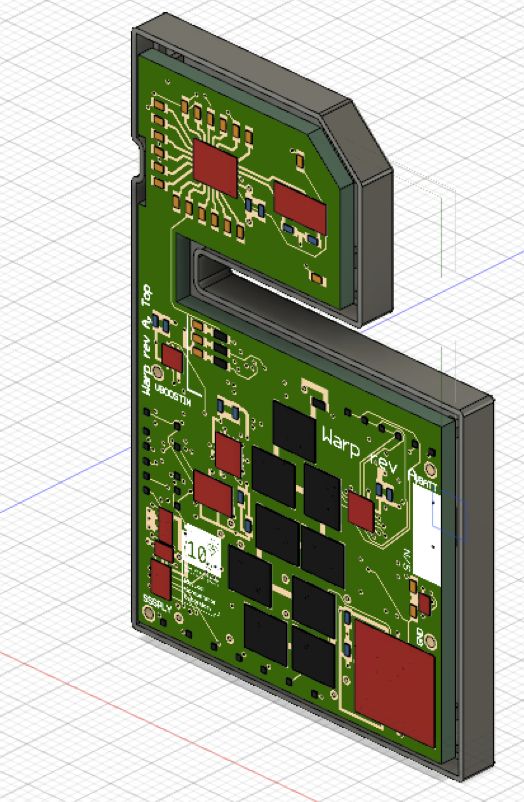
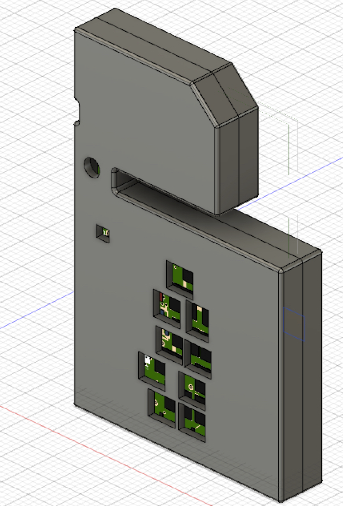

# Warp
Warp is a hardware platform for efficient multi-modal sensing with adaptive approximation. The hardware contains 11 sensor integrated circuits (ICs) and a total of 21 different sensors. The design includes circuit-level facilities for trading sensor accuracy for power dissipation, and circuit-level facilities for trading sensor communication reliability for power dissipation. The sensors in Warp cover eight sensing modalities: temperature, pressure, 3-axis acceleration, 3-axis angular velocity, 3-axis magnetic flux density, humidity, infrared, color/light (615nm, 525nm, 465nm).


## Prerequisites
We provide the hardware design files in the Eagle CAD format. You can use the free version of Eagle for MacOS, Linux, Windows to view the files. The design is a 10-layer PCB. You will need the full version of Eagle to make modifications. [For academics, the full version of Eagle (Eagle Professional) is completely free](https://knowledge.autodesk.com/support/eagle/learn-explore/caas/sfdcarticles/sfdcarticles/Eagle-Education.html). For non-university hobbyists, Eagle is relatively inexpensive and can also be purchased on a month-at-a-time subscription.

We also provide the hardware design files as Gerbers. You can use any of the numerous free Gerber viewers to view the design.


## Getting boards manufactured
The repository contains detailed instructions for getting the boards manufactured. We provide a pre-populated BOM file with part numbers for purchasing the components from Mouser. Before getting your own boards manufactured, it is worthwhile getting in touch with us for a brief discussion of things to be careful about in providing instructions to your board assembly house.


## Adapting the designs
We license the Warp hardware designs under a BSD license. See details in [LICENSE.txt](https://github.com/physical-computation/Warp-hardware/blob/master/LICENSE.txt).


## Generating Gerbers for manufacturing
The repository comes with the Gerber files pre-generated. You can generate your own Gerber files and drill files for manufacturing using Eagle.


## Getting boards assembled
Basic [BOM](https://github.com/physical-computation/Warp-hardware/blob/master/revA/bom/mouser/warp-revA-bom.xlsx) (uses Mouser for components).


# Implementation and Debug


# Mechanical CAD Models for Board and Enclosures
The repository also contains a mechanical CAD model for the board and designs for enclosures, in Autodesk Fusion 360 format. [For academics, the full version of Autodesk Fusion 360 is completely free](https://www.autodesk.co.uk/products/fusion-360/students-teachers-educators). For non-university hobbyists, Fusion 360 is relatively inexpensive and can be purchased on a month-at-a-time subscription.



## Getting firmware
You can obtain baseline firmware for the Warp platform from the [Warp firmware](https://github.com/physical-computation/Warp-firmware) repository.


## Bugs
See the GitHub issues for a complete list. Before getting your own boards manufactured, it is worthwhile getting in touch with us for a brief discussion of things to be careful about in providing instructions to your board assembly house and hints for getting the firmware running on Warp for the first time.


## If you use Warp in your research, please cite it as:
Phillip Stanley-Marbell and Martin Rinard. “A Hardware Platform for Efficient Multi-Modal Sensing with Adaptive Approximation”. ArXiv e-prints (2018). arXiv:1804.09241.

**BibTeX:**
````
@ARTICLE{1804.09241,
  author = {Stanley-Marbell, Phillip and Rinard, Martin},
  title = {A Hardware Platform for Efficient Multi-Modal Sensing with Adaptive Approximation},
  journal = {ArXiv e-prints},
  archivePrefix = {arXiv},
  eprint = {1804.09241},
  year = 2018,
}
````

### Acknowledgements
This research is supported by an Alan Turing Institute award TU/B/000096 under EPSRC grant EP/N510129/1, by Royal Society grant RG170136, and by EPSRC grants EP/P001246/1 and EP/R022534/1.
